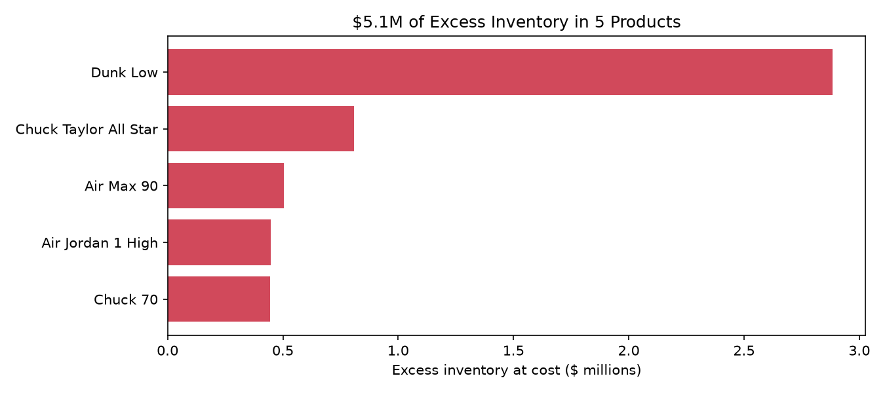
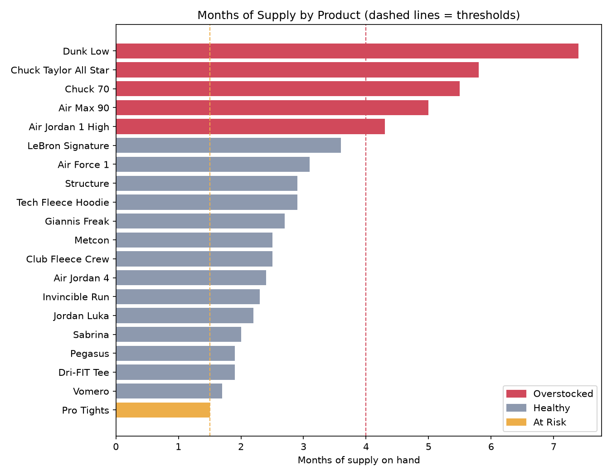

# Inventory Optimization at Nike
### Matching Supply to Real Demand

> Independent analysis using public data. Not affiliated with Nike, Inc.

## The Problem
Nike has spent the past year clearing "unhealthy" inventory from the marketplace,
which management said cut roughly five points from reported results in Q3 fiscal 2026.
Gross margin fell 130 basis points to 40.2% that quarter, and inventory rose 5% to
$7.8 billion between May 31 and August 31, 2026.

## Key Findings 

- **$5.1M of excess inventory sits in just 5 of 20 products.** Dunk Low alone holds
  $2.9M, with 7.4 months of supply against a 4-month threshold.
- **The overstock is in aging classics, not growth lines.** Dunk Low, Chuck Taylor,
  Chuck 70, Air Max 90, and Air Jordan 1 High are all overstocked.
- **Running is under-supplied.** Pegasus and Vomero, the two top revenue products,
  carry under 2 months of supply while demand is trending up.
- **Low-value products tie up cash.** Both Converse lines rank B or C in revenue, yet
  hold about $1.25M of excess stock.

## Recommendation
Stop reordering the 5 overstocked products and redirect purchasing to growth lines.
The reorder model recommends $10.1M in orders across 9 products, led by Pegasus
($4.1M) and Vomero ($3.4M), with zero new orders for overstocked items.

## Questions This Project Answers
1. How much of each product line will actually sell? (demand forecasting)
2. Which product lines drive the business? (ABC analysis)
3. Which products are overstocked, and how early can we catch them? (months of supply)
4. How much should Nike order for each product line? (reorder planning)
5. How much inventory, in dollars, is tied up in excess stock?

## Methods
- **Months of supply:** units on hand divided by average monthly demand (last 12 months)
- **Status flags:** over 4 months = Overstocked; under 1.5 months = At Risk
- **ABC analysis:** products ranked by revenue using SQL window functions; A = top 80%
- **Safety stock:** Z-score (95% service level) × demand std dev × √lead time
- **Reorder plan:** 3 months of trend-adjusted forecast + safety stock − stock on hand and on order

## Data
- Company-level figures: Nike SEC filings (Form 10-K fiscal 2026, Form 10-Q Q1 fiscal 2027)
- Product-level data: simulated for 20 representative product lines. Costs, prices,
  quantities, and lead times are illustrative estimates, not Nike-reported figures.

## Project Structure
- `data/`: product and sales data, plus the SQLite database
- `sql/`: SQL queries (months of supply, status flags, ABC analysis)
- `src/`: Python scripts, run in order 01 → 06
- `output/`: reorder plan CSV and Excel report

## Tools
Python (pandas), SQL (SQLite), Excel
